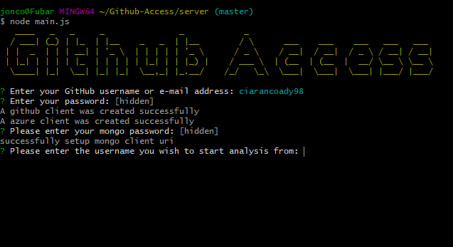
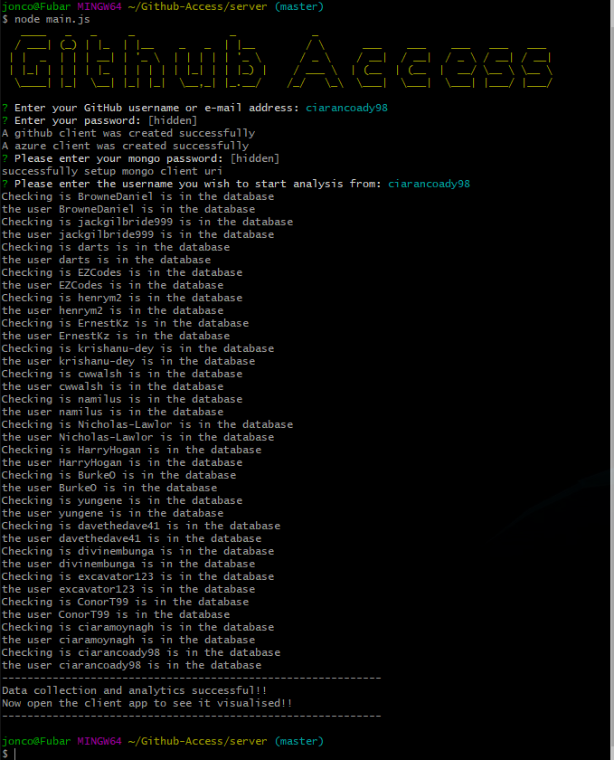
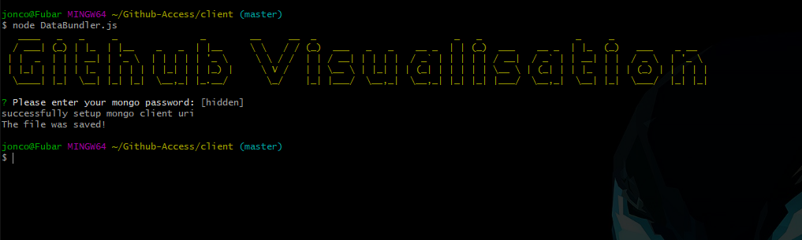
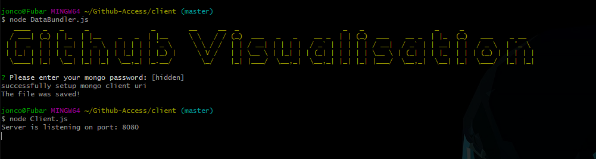
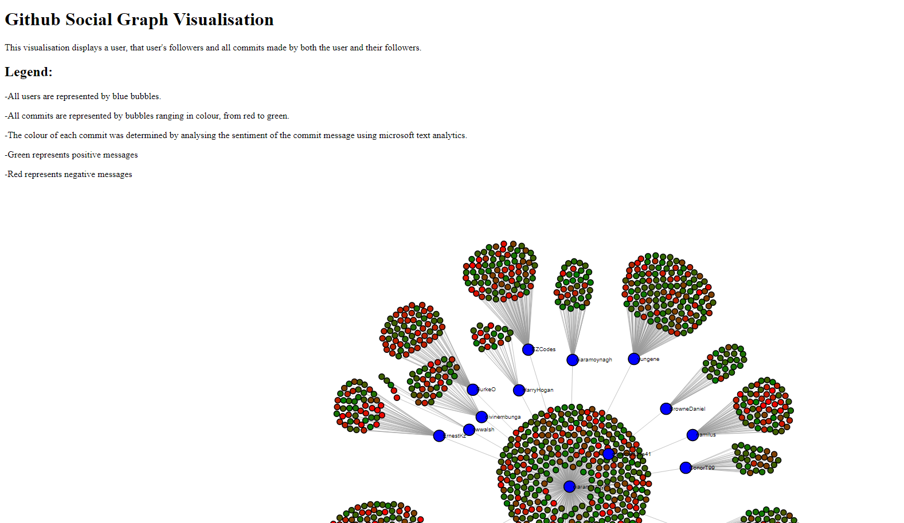

# Github-Access & Social Graph
I created this application as part of the coursework assigned to me while participating in the course CS3012 software engineering.

## Task
Interrogate the GitHub API to build visualisation of data available that elucidates some aspect of the softare engineering process, such as a social graph of developers and projects, or a visualisation of indiviudal or team performance. Provide a visualisation of this using the d3js library. See https://d3js.org

## Idea
Based on my research of existing data analytics conducted using the github api, I thought an interesting metric to analyse would be the sentiment of peoples commit messages. I found this interesting as I could easily view how positive or negative myself and my peers are when it comes to our work. From this information it could be inferred if the person would boost or reduce moral when working on a group project.

## Demo

# Master Branch
Contains the most up-to-date working version of the application. The application works in two parts, the server and the client.

### Note
The initial github access part of this project is described by commit 358fd5036cd3b4fca2840a4d9d763178f31b01a1.

## Server
The server is a command line data gathering application written in nodejs. This application gathers data using the github api about a logged in user and their followers. It then analyses users commits and the sentiment of commit messages using microsoft text analysis. Then all data is stored to a mongo database where it can later be used by the client.

## Client
The client is broken into two components, a command line data processing application, and a html visualisation powered by d3. The data processing element reads the data gathered by the server, from the database and parses it into a format for visualisation.
Then using express the html webpage is delivered to the user. The webpage displays a user, their followers and all commits made by the user and their followers. Users are represented by blue bubbles while commits are represented by bubbles ranging from red to green depending on sentiment.

# Requirements 
[NodeJS](https://nodejs.org/en/) 
[MongoDB](https://www.mongodb.com/) 
[Microsoft Cognitive Services](https://azure.microsoft.com/en-us/services/cognitive-services/text-analytics/) 
 
In my own deployment I hosted my mongo database using the free service found on the mongo website. I also used a free trial of the text analysis service provided by microsoft.

# Deployment

Clone the repo using the command `git clone https://github.com/ciarancoady98/Github-Access.git`. 
After cloning the repo navigate to the server folder and perform an npm install `npm install`. 
Once complete then copy the mongodbApiKeys_template.js and azureApiKeys_template.js files renaming them to mongodbApiKeys.js and azureApiKeys.js. Then populate these files with the correct api keys for your deployment. 
To run the data collection phase of the application, run the main.js file `node main.js`. 

 
 
Now that the data has been collected and inserted into the database we a ready to run the visualisation phase. 
Navigate back to the root directory and then to client. 
Perform an npm install `npm install`. 
Once complete then copy the mongodbApiKeys_template.js file renaming it to mongodbApiKeys.js. Then populate this file with the correct api keys as we did for the server. 
To run the data parsing phase of the application run the DataBundler.js file `node DataBundler.js`. 
 
This should create the dataset.json from the contents of the database. 
At this point everything is ready for the visualisation and we can host the webpage locally using the Client.js file. `node Client.js`. 
 
Once the express server has launched we can then access the the webpage by searching for localhost:8080. 
 

# Measuring-Software-Engineering Branch 
A report on the ways in which the software engineering process can be measured and assesed in terms of measurable data, an overview of the computationial platforms available to perform this work, the algorithmic approachs available, and the ethics concerns surrounding this kind of analytics.
